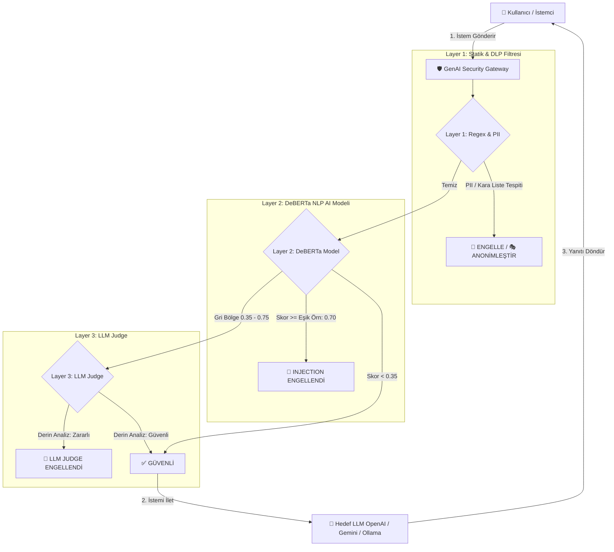

<div align="center">

# 🛡️ GenAI Security Gateway

### *Enterprise-Grade 3-Layer Security Firewall & Proxy for LLMs*

[](https://www.python.org/)
[](https://fastapi.tiangolo.com/)
[](https://streamlit.io/)
[](https://pytorch.org/)
[](https://www.docker.com/)
[](https://www.postgresql.org/)

**GenAI Security Gateway**, yapay zeka (LLM) sistemlerine gönderilen istemleri (prompt'ları) zararlı içeriklere, **Prompt Injection** ve **Jailbreak** saldırılarına, **PII (Kişisel Veri) sızıntılarına (DLP)** ve gizli veri ihlallerine karşı gerçek zamanlı koruyan 3 katmanlı gelişmiş bir güvenlik duvarı ve akıllı proxy sistemidir.

[📌 Özellikler](#-öne-çıkan-özellikler) •
[🛡️ Güvenlik Mimarisi](#%EF%B8%8F-3-katmanlı-güvenlik-mimarisi) •
[🚀 Hızlı Başlangıç](#-hızlı-başlangıç) •
[🐳 Docker Kurulumu](#-docker--sunucu-kurulumu) •
[📂 Proje Yapısı](#-proje-dizin-yapısı) •
[📊 Admin Paneli](#-admin-paneli-ve-dashboard)

---

</div>

## 📖 Projenin Amacı ve Neden Gereklidir?

Büyük Dil Modelleri (LLM'ler), kurumlar ve son kullanıcılar tarafından hızla benimsenirken ciddi **güvenlik tehditlerini** de beraberinde getirmiştir:
- **Prompt Injection & Jailbreak:** Saldırganların yapay zekayı manipüle ederek sistem talimatlarını aşması veya yasaklı içerik ürettirmesi.
- **Veri Sızıntısı (DLP & PII):** Kullanıcıların TC Kimlik No, Kredi Kartı, IBAN, API anahtarı veya iç iletişim verilerini istem dışı LLM'lere göndermesi.
- **Görünürlük ve Denetim Eksikliği:** Hangi kullanıcının LLM'e ne tür istemler gönderdiğinin izlenememesi.

**GenAI Security Gateway**, LLM ile kullanıcı arasına girerek tüm istemlerin **milisaniyeler içerisinde taranıp filtrelenmesini**, zararlı veya hassas içeriklerin engellenmesini ya da anonimleştirilmesini sağlar.

---

## 🛡️ 3 Katmanlı Güvenlik Mimarisi

Sistem, maksimum güvenlik ve minimum gecikme süresi (latency) dengesi için 3 kademeli doğrulama algoritması kullanır:



### 1️⃣ Katman 1: Statik Kural, Kara Liste ve PII/DLP Kontrolü (`< 5ms`)
- **Ultra Hızlı Filtreleme:** Regex ve kelime dizin tabanlı analiz ile mikrosaniyeler içinde çalışır.
- **Hassas Veri Tespiti (PII):** TC Kimlik Numarası, Kredi Kartı, IBAN, E-posta adresi, Telefon Numarası ve API Key sızıntılarını anında tespit eder.
- **Anonimleştirme (Layer 1.5):** İsteğe bağlı olarak hassas verileri `[MASKED_TCKN]` şeklinde maskeleyerek LLM'e iletir.

### 2️⃣ Katman 2: Fine-Tuned DeBERTa AI Modeli (`~20-50ms`)
- **Doğal Dil İşleme (NLP):** Transformer tabanlı DeBERTa mimarisi kullanılarak karmaşık, dolaylı ve dilsel manipülasyon içeren Prompt Injection ve Jailbreak saldırılarını analiz eder.
- **Özel Veri Seti:** Türkçe ve İngilizce 1000+'den fazla özel güvenlik veri seti ve sentetik saldırı senaryoları ile eğitilmiştir.
- **Dinamik Duyarlılık (Threshold):** Yönetim panelinden canlı olarak güvenlik eşik skoru (ör. `0.70`) ayarlanabilir.

### 3️⃣ Katman 3: LLM Judge - Üst Düzey Niyet Analisti (`Grey Zone`)
- **Derin Anlamsal Karar Verici:** Layer 2'nin kararsız kaldığı "Gri Bölge" (Skor `0.35` - `0.75` arası) istemleri üst seviye bir karar verici LLM'e (ör. GPT-4o-mini / Gemini) sevk eder.
- **Fail-Closed Güvenlik Prensibi:** Şüpheli durumlarda güvenlik önceliklendirilir.

---

## ✨ Öne Çıkan Özellikler

- ⚡ **Yüksek Performans & Önbellekleme:** In-memory caching ve asenkron mimari sayesinde minimum gecikme.
- 🎛️ **Gelişmiş Admin & Dashboard Paneli:** Streamlit & HTML/CSS tabanlı interaktif yönetim arayüzü.
- 🔀 **LLM Proxy Modu:** İstem güvenliyse doğrudan OpenAI, Gemini veya yerel Ollama modellerine şeffaf aktarım.
- 📊 **Detaylı Loglama & Denetim İzleri:** Her isteğin hangi katmanda engellendiği, gecikme süreleri (ms) ve kategorisi kayıt altına alınır.
- 🔑 **Şirket ve Kullanıcı Bazlı Yetkilendirme:** JWT tabanlı kimlik doğrulama, oran sınırlaması (Rate Limiting) ve şirket politikası yönetimi.
- 🛠️ **Dinamik Kara Liste Yönetimi:** Kod yeniden başlatılmadan arayüzden anlık kelime ekleme/çıkarma.
- 🐳 **Docker & Production Hazır:** Single-command Docker Compose yapısı, PostgreSQL asenkron havuzu ve Reverse Proxy desteği.

---

## 🚀 Hızlı Başlangıç

### Gereksinimler
- **Python 3.10+**
- **Git**
- *(İsteğe Bağlı)* **Docker & Docker Compose**

### 1. Projeyi Klonlayın
```bash
git clone https://github.com/FidanAkyurek/GenAI_GateAway.git
cd GenAI_GateAway/GenAI_Gateway
```

### 2. Sanal Ortamı Oluşturun ve Bağımlılıkları Yükleyin
```bash
# Sanal ortam oluşturma
python -m venv .venv

# Sanal ortamı aktifleştirme (Windows PowerShell)
.\.venv\Scripts\Activate.ps1

# (Linux / macOS için: source .venv/bin/activate)

# Bağımlılıkları yükleme
pip install -r requirements.txt
```

### 3. Ortam Değişkenlerini Ayarlayın
`.env.template` dosyasını kopyalayarak `.env` oluşturun:
```bash
cp .env.template .env
```
`.env` dosyasını düzenleyerek gerekirse `GEMINI_API_KEY`, `JWT_SECRET` vb. anahtarlarınızı girin.

### 4. Tek Tıkla Sistemi Çalıştırın (Windows / Python)

Sistem hem FastAPI arka yüzünü (`http://127.0.0.1:8001`) hem de Streamlit arayüzünü (`http://127.0.0.1:8501`) otomatik olarak başlatır:

**PowerShell ile:**
```powershell
.\start.ps1
```

**veya CMD ile:**
```cmd
start_all.bat
```

**veya Çapraz Platform Python Betiği ile:**
```bash
python start_system.py
```

---

## 🐳 Docker & Sunucu Kurulumu

Üretim ortamında (Production) PostgreSQL veritabanı ile çalıştırmak için Docker Compose kullanabilirsiniz:

```bash
# Konteynerleri derleyin ve arka planda çalıştırın
docker compose up -d --build

# Konteyner durumlarını kontrol edin
docker compose ps

# Canlı logları izleyin
docker compose logs -f web
```

Uygulama **`http://localhost:8001`** (FastAPI) ve **`http://localhost:8501`** (Streamlit) üzerinde yayına girecektir.

---

## 📊 Admin Paneli ve Dashboard

Yönetim paneli üzerinden aşağıdaki işlemler gerçekleştirilebilir:

1. **Güvenlik Dashboard'u:** Anlık istek sayıları, engellenen vs. geçen istek oranları, ortalama yanıt süreleri ve tehdit dağılım grafikleri.
2. **Canlı Log İnceleme:** Güvenlik loglarını kategoriye (PII, Prompt Injection, Jailbreak) göre filtreleme, ayrıntılı arama ve popup detay görünümü.
3. **Canlı Sistem Ayarları:**
   - Katmanları (Layer 1, Layer 2, Layer 3) anlık olarak aktif/pasif yapma.
   - DeBERTa modelinin duyarlılık eşiğini (Threshold Slider) canlı değiştirme.
   - Kara liste kelimelerini arayüzden yönetme.

---

## 📂 Proje Dizin Yapısı

```
GenAI_Gateway/
├── app/                        # 🧠 Backend (FastAPI Core)
│   ├── main.py                 # FastAPI Giriş Noktası & API Endpoint'leri
│   ├── config_manager.py       # Dinamik Yapılandırma Yöneticisi
│   ├── controllers/            # API İstek Kontrolcüleri
│   ├── models/                 # Pydantic ve Veritabanı Modelleri
│   └── services/               # 🛡️ Güvenlik Servisleri & Katmanları
│       ├── layer1_regex.py     # Layer 1: Regex & PII Tespit Servisi
│       ├── layer1_5_anonymizer.py # Layer 1.5: Maskeleme & Anonimleştirme
│       ├── layer2_deberta.py   # Layer 2: DeBERTa AI Modeli Servisi
│       ├── layer3_llm_judge.py # Layer 3: LLM Judge Derin Analiz Servisi
│       ├── llm_proxy.py        # Akıllı LLM Proxy İletim Servisi
│       └── database_manager.py # SQLite / PostgreSQL Async Veritabanı Yöneticisi
├── frontend/                   # 💻 Alternatif HTML/JS/CSS Arayüzü
├── scripts/                    # 🛠️ Model Eğitimi & Yardımcı Araçlar
│   ├── train_deberta.py        # DeBERTa Fine-Tuning Eğitimi
│   └── check_env.py            # Ortam Değişkenleri Doğrulama Betiği
├── data_generation_scripts/    # 📈 Veri Seti Üretim Betikleri
├── database_scripts/           # 💾 Veritabanı Sıfırlama & Migration Betikleri
├── tests/                      # 🧪 Birim ve Entegrasyon Testleri
├── streamlit_app.py            # 🎛️ Streamlit Admin Paneli & Dashboard
├── Dockerfile                  # Docker İmaj Yapılandırması
├── docker-compose.yml          # Multi-Container Orkestrasyonu
├── start.ps1 / start_all.bat   # 🚀 Hızlı Başlatma Betikleri
└── requirements.txt            # Python Bağımlılıkları
```

---

## 🧪 Testler ve Doğrulama

Sistemin güvenlik katmanlarını ve API endpoint'lerini test etmek için test paketini çalıştırabilirsiniz:

```bash
pytest tests/
```

Sentetik veri üreterek yük testi simülasyonu yapmak için:
```bash
python data_generation_scripts/generate_synthetic_massive_dataset.py
```

---

## 🤝 Katkıda Bulunma

1. Bu depoyu çatallayın (Fork).
2. Yeni bir özellik dalı oluşturun (`git checkout -b feature/YeniOzellik`).
3. Değişikliklerinizi işleyin (`git commit -m 'feat: Yeni özellik eklendi'`).
4. Dalınıza itin (`git push origin feature/YeniOzellik`).
5. Bir Çekme İsteği (Pull Request) açın.

---

## 📝 Lisans

Bu proje **MIT Lisansı** altında lisanslanmıştır.

---

<div align="center">

Geliştirici: **[Fidan Akyürek](https://github.com/FidanAkyurek)**

*GenAI Security Gateway — Yapay Zeka Sistemleriniz İçin Güvenli Gelecek.*

</div>
